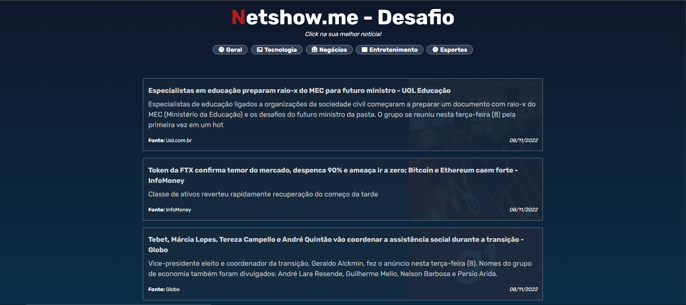

### Overview

Teste técnico proposto para vaga Front-end (Marketing) na Netshow.me

Aplicativo desenvolvido neste repositório tem como característica um portal de notícias com 10 artigos nos temas: Geral, Tecnologia, Negócios, Entretenimento e Esportes.

Para desenvolver está solução, fiz o consumo da [NewsAPI](https://newsapi.org/) para extrair manchetes via JSON e alimentar a aplicação.

Trata-se de uma aplicação com estilização simples no qual dediquei-me a fazer uma estrutura de código limpo com boas práticas de programação.

### Notas

Estou disponibilizando minhas credenciais de acesso da [NewsAPI](https://newsapi.org/) no arquivo `.env.local` para facilitar na hora colocar o app para funcionar.

##### OBS: NodeJs e GIT deve está instalado em sua máquina.

Para rodar projeto basta clonar o repositório `https://github.com/zeerlen/breaking-news.git`, logo em seguida instalar às dependências com `npm install` no terminal do diretório raiz do projeto, depois rodar `npm rum dev` e acessar `http://localhost:3000`.

API usada na aplicação tem bloqueio no cors para uso free (acesso apenas via `localhost`) enviabilizando deploy em qualquer plaforma de hospedagem como o Vercel por exemplo, porém para fins de desenvolvimento (acadêmico) e testes via `localhost` funciona muito bem.

Note que a API pode sim funcionar com chamadas externas sem ser via `localhost`, porém a um custo envolvido para adquirir um plano premium. Para mais informações acesse [NewsAPI](https://newsapi.org/).

### Screenshots - Desktop

### Screenshots - Mobile

