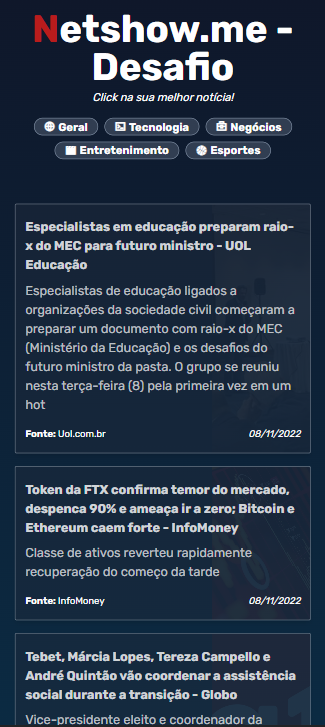

### Teste técnico proposto para vaga Front-end (Marketing) na Netshow.me

Aplicativo desenvolvido neste repositório tem como característica um portal de notícias com 10 artigos nos temas: Geral, Tecnologia, Negócios, Entretenimento e Esportes.

Para desenvolver a solução, fiz o consumo da [NewsAPI](https://newsapi.org/) para extrair manchetes via JSON e alimentar a aplicação.

Trata-se de uma aplicação com estilização simples no qual dediquei-me a fazer uma estrutura de código limpo com boas práticas de programação.

### Screenshots

   

